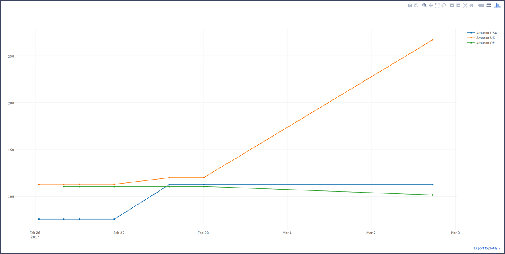

# selenium-price-crawler
Fetches product prices from the web, converts the currencies and plots price development on a graph.

## Operation
The program runs through an input file, with input rows such as the rows below:  
* <code>Amazon USA|https://www.amazon.com/Invicta-8926OB-Analog-Japanese-Automatic-Stainless/dp/B000JQFX1G/ref=sr_1_1?ie=UTF8&qid=1487952192&sr=8-1&keywords=invicta+8926ob |priceblock_ourprice|USD|39.03</code>
* <code>Amazon UK|https://www.amazon.co.uk/Invicta-Automatic-Display-Stainless-Bracelet/dp/B000JQFX1G/ref=sr_1_1?ie=UTF8&qid=1488058883&sr=8-1&keywords=invicta+8926ob |priceblock_ourprice|GBP|6.22</code>
* <code>Amazon DE|https://www.amazon.de/Invicta-Herren-Armbanduhr-Automatik-Edelstahl-8926/dp/B000JQFX1G |priceblock_ourprice|EUR</code>
  

The syntax for a input row is as follows:  
<code>Handle|URL|Price_tag_id|Currency_code|Optiona_price_offset_decimal</code>  

The results of the crawl will be output to "watch_prices.txt". This file will then be input to the Plotly graph plotter, which will use the input to create a graph HTML file like below:

